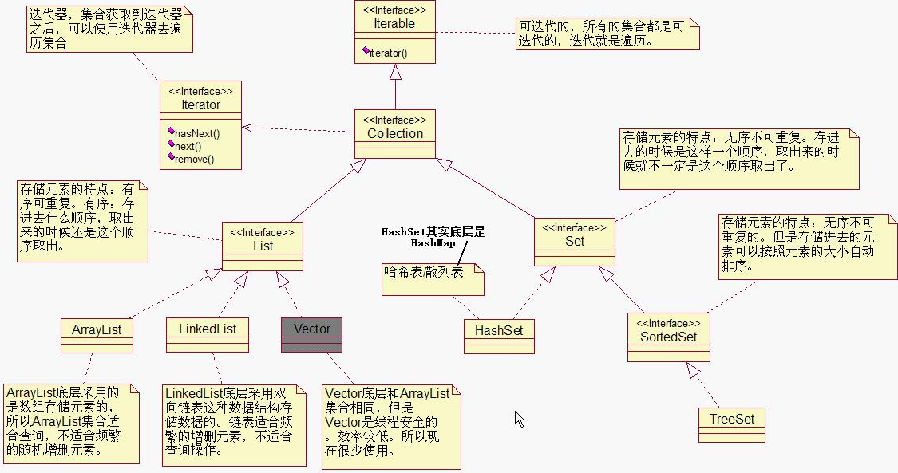
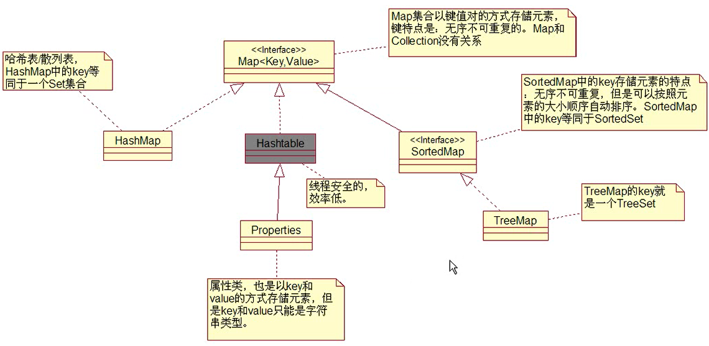

# 集合

## 集合继承结构图





## 集合迭代

```java
/*
    集合
*/

import java.util.*;
public class Test{
    
    public static void main(String[] args) throws Exception{
        // 创建集合对象
        Collection c = new LinkedList();
        c.add(100);
        c.add(3.14);
        c.add(false);
        
        Iterator it = c.iterator(); // c 集合
        
        while(it.hasNext()){
            Object element = it.next();
            System.out.println(element);
        }
        
    }
}
```

## 集合的常用方法

### contains

```
/*
    集合的常用方法
    存储在集合中的对象应该重写equals方法
*/

import java.util.*;
public class Test{
    
    public static void main(String[] args) throws Exception{
        Collection c = new ArrayList();
        
        // 创建两个Integer类型的对象
        Integer i1 = new Integer(10);
        
        // 添加元素
        c.add(i1);
        
        System.out.println(c.contains(i1)); // true 判断集合里是否包含对象
        
        Integer i2 = new Integer(10);
        
        // contains 方法底层调用的时equals方法，如果equals返回true， 就是包含
        // ArrayList 底层已重写了equals方法
        System.out.println(c.contains(i2)); // true
        
        Manager m1 = new Manager(1, "zhangsan");
        c.add(m1);
        System.out.println(c.contains(m1)); // true
        
        Manager m2 = new Manager(1, "zhangsan"); 
        
        // 重写equals方法之前 
        // System.out.println(c.contains(m2)); // false
        
        // 重写equals方法之后 
        System.out.println(c.contains(m2)); // true
        
    }
}


class Manager{
    int no;
    String name;
    
    Manager(int no, String name){
        this.no = no;
        this.name = name;
    }
    
    // 如果编号和姓名都相同，则表示同一个Manager
    public boolean equals(Object o){
        if(this == o){
            return true;
        }
        if(o instanceof Manager){
            Manager m = (Manager) o;
            if(m.no == this.no && m.name.equals(this.name)){
                return true;
            }
        }
        return false;
        
    }
}
```

### remove

```java
/*
    集合的常用方法
    存储在集合中的对象应该重写equals方法
*/

import java.util.*;
public class Test{
    
    public static void main(String[] args) throws Exception{
        Collection c = new ArrayList();
        
        // 创建两个Integer类型的对象
        Integer i1 = new Integer(10);
        
        // 添加元素
        c.add(i1);
        
        
        Integer i2 = new Integer(10);
        
        // 删除
        c.remove(i2);
        
        System.out.println(c.size()); // 0

    }
}
```

```java
/*
    迭代删除
*/

import java.util.*;
public class Test{
    
    public static void main(String[] args) throws Exception{
        Collection c = new ArrayList();
        
        c.add(1);
        c.add(2);
        c.add(3);
        c.add(4);
        
        Iterator it = c.iterator();
        
        while(it.hasNext()){
            it.next();
            it.remove();
        }
        
        System.out.println(c.size()); // 0
    }
}
```

# List

