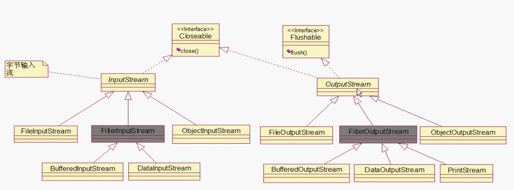

# IO流

Java语言中的流分为四大家族 (InputStream, OutputStream, Reader, Writer)

**InputStream, OutputStream 继承结构图**



**Reader和Writer继承关系结构图**


## FileInputStream

```java
/*
    FileInputStream
    文件字节输入流，按字节方式读取文件
*/

import java.io.*;
public class Test{
    
    public static void main(String[] args) throws Exception{
        FileInputStream fis = null;
        try{
            // 要读取文件，需要先创建文件输入流
            // String filePath = "D:\\StanLong\\git_repository\\Java\\chapter07\\IO流.md";
            String filePath = "D:/StanLong/git_repository/Java/chapter07/IO流.md"; // 用 // 或者 \ 做路径分隔符都可以
            fis = new FileInputStream(filePath);
            System.out.println(fis.available()); // 文件的总字节数
            
            fis.skip(2) // 跳过两个字节再读
            
            /*
            // 按单个字节读，这样读会频繁访问磁盘，效率低
            // 开始读
            int i1 = fis.read(); // 以字节的方式读取, 如果读完了， 返回 -1
            System.out.println(i1);
            
            // 循环读
            int temp = 0
            while((temp == fis.read()) != -1){
                System.out.println(temp);
            }*/
            
            
            // 按字节数组读, 每次读取多个字节存储到byte数组中
            byte[] bytes = new byte[3];
            int result = fis.read(bytes); // 返回读取了多少个字节
            System.out.println(new String(bytes)); // 将字节数组转换成字符串
            System.out.println(new String(bytes, 0, result)); // 这样读的数据才合法
            
            // 循环读
            int temp == 0;
            while((temp = fis.read(bytes)) != -1){
                System.out.println(new String(bytes, 0, temp));
            }
            
            
        }catch(FileNotFoundException e){
            e.printStackTrace();
        }catch(IOException e){
            e.printStackTrace();
        }finally{
            if(fis != null){
                try{
                    fis.close();
                }catch(IOException e){
                    e.printStackTrace();
                }
                
            }
            
        }
    }
}
```

## FileOutputStream

```java
/*
    FileOutputStream
    文件字节输出流，将计算机内存中的数据写入到硬盘中
*/

import java.io.*;
public class Test{
    
    public static void main(String[] args) throws Exception{
        FileOutputStream fos = null;
        try{
            // 要写入的内容
            String msg = "HelloWorld";            
            // 将String转换成byte数组
            byte[] bytes = msg.getBytes();
            
            // 开始写
            // fos = new FileOutputStream("Test1.java"); // 覆盖写入
            fos = new FileOutputStream("Test1.java", true); // 追加写入
            // fos.write(bytes);  // 将byte数组中的所有内容写入
            fos.write(bytes, 0, 3); // 将byte数组中的一部分内容写入
            
            
            fos.flush(); // 强制写入
        }catch(FileNotFoundException e){
            e.printStackTrace();
        }catch(IOException e){
            e.printStackTrace();
        }finally{
            if(fos != null){
                try{
                    fos.close();
                }catch(IOException e){
                    e.printStackTrace();
                }
                
            }
            
        }
    }
}
```

## 文件复制

```java
/*
    文件复制
    可以复制任意类型的文件
*/

import java.io.*;
public class Test{
    
    public static void main(String[] args) throws Exception{
        FileInputStream fis = null;
        FileOutputStream fos = null;
        try{
            
            fis = new FileInputStream("Test1.java");
            
            fos = new FileOutputStream("D:/StanLong/git_repository/Java/chapter06/abc.txt");
            
            // 一边读，一边写
            int temp = 0;
            byte[] bytes = new byte[1024];
            while((temp = fis.read(bytes))!=-1){
                // 将byte数组中的内容直接写入
                fos.write(bytes, 0, temp);
            }
            fos.flush(); // 强制写入
        }catch(FileNotFoundException e){
            e.printStackTrace();
        }catch(IOException e){
            e.printStackTrace();
        }finally{
            if(fos != null){
                try{
                    fis.close();
                    fos.close();
                }catch(IOException e){
                    e.printStackTrace();
                }
                
            }
            
        }
    }
}
```

## FileReader

```java
/*
    FileReader
    文件字符输入流
*/

import java.io.*;
public class Test{
    
    public static void main(String[] args) throws Exception{
        FileReader fr = null;
        try{
            fr = new FileReader("Test.java");
            
            char[] chars = new char[512];
            
            int temp = 0;
            while((temp = fr.read(chars))!=-1){
                System.out.print(new String(chars, 0, temp));
            }
        }catch(FileNotFoundException e){
            e.printStackTrace();
        }catch(IOException e){
            e.printStackTrace();
        }finally{
            if(fr != null){
                try{
                    fr.close();
                }catch(IOException e){
                    e.printStackTrace();
                }
                
            }
            
        }
    }
}
```

## FileWriter

```java
/*
    FileWriter
    文件字符输出流
*/

import java.io.*;
public class Test{
    
    public static void main(String[] args) throws Exception{
        FileWriter fw = null;
        try{
            fw = new FileWriter("Test2.txt", true); // 追加写入
            
            // 写入字符串
            fw.write("中国万岁!");
            
            char[] chars = {'贵','出','如','粪','土','，','贱','取','如','珠','玉'};
            
            // 写入字节数组
            fw.write(chars, 0, 5);
            
            fw.flush();
        }catch(FileNotFoundException e){
            e.printStackTrace();
        }catch(IOException e){
            e.printStackTrace();
        }finally{
            if(fw != null){
                try{
                    fw.close();
                }catch(IOException e){
                    e.printStackTrace();
                }
                
            }
            
        }
    }
}
```

## 文件复制

```java
/*
    文件复制
    只能复制文本文件
*/

import java.io.*;
public class Test{
    
    public static void main(String[] args) throws Exception{
        FileReader fr = null;
        FileWriter fw = null;
        try{
            fr = new FileReader("Test2.txt");
            fw = new FileWriter("D:/StanLong/git_repository/Java/chapter06/abc2.txt"); 
            
            char[] chars = new char[512];
            int temp = 0;
            
            while((temp = fr.read(chars)) != -1){
                fw.write(chars, 0 , temp);
            }
            
            
            fw.flush();
        }catch(FileNotFoundException e){
            e.printStackTrace();
        }catch(IOException e){
            e.printStackTrace();
        }finally{
            if(fw != null){
                try{
                    fr.close();
                    fw.close();
                }catch(IOException e){
                    e.printStackTrace();
                }
                
            }
        }
    }
}
```

